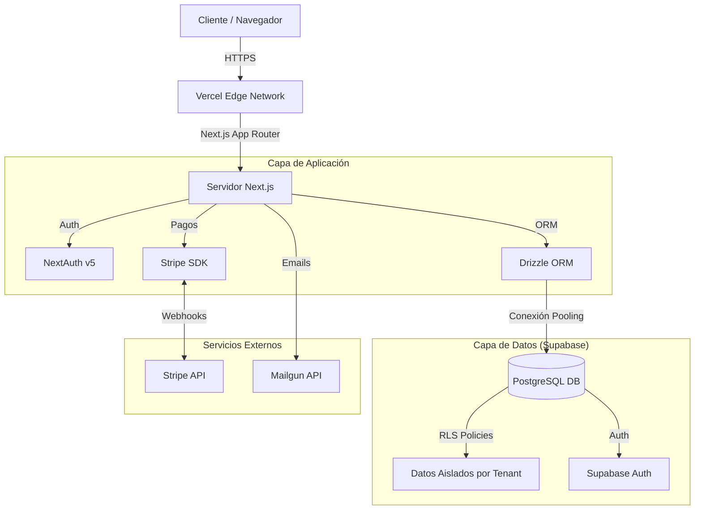

# Arquitectura del Sistema – Zaltyko SaaS

Este documento describe la arquitectura técnica implementada en **Zaltyko SaaS**. El sistema sigue una arquitectura monolítica modular basada en Next.js, diseñada para la escalabilidad horizontal y el aislamiento estricto de datos (Multi-tenancy).

## 🏗️ Diagrama de Alto Nivel

## 🔐 Modelo de Multi-Tenancy (Aislamiento)

El núcleo de la seguridad de Zaltyko es el aislamiento de datos. No utilizamos bases de datos separadas por cliente, sino un modelo de **Discriminador de Columna** reforzado por **Row Level Security (RLS)**.

1.  **Identificación**: Cada petición HTTP identifica el `tenant_id` (Academia) basándose en la URL (`/app/[academyId]/...`) o el usuario autenticado.
2.  **Base de Datos**: Todas las tablas sensibles (`athletes`, `classes`, `payments`) tienen una columna `tenant_id`.
3.  **RLS (Postgres)**: Políticas de seguridad en la base de datos impiden físicamente que una consulta retorne datos de otro `tenant_id`, incluso si la aplicación falla en filtrar.

## 🧩 Componentes Principales

### 1. Autenticación y Autorización (`src/lib/authz.ts`)
- **Autenticación**: Manejada por NextAuth.js sincronizado con usuarios de Supabase.
- **Autorización**: Sistema de permisos basado en roles (`owner`, `admin`, `coach`, `athlete`).
- **Middleware**: Intercepta rutas protegidas y valida la sesión antes de renderizar.

### 2. Motor de Facturación (`src/lib/billing`, `src/lib/limits.ts`)
- **Suscripciones**: Sincronización bidireccional con Stripe.
- **Límites**: Lógica de negocio ("Hard Limits") que impide crear recursos (ej. más de 30 gimnastas en Free) si el plan actual no lo permite.
- **Webhooks**: Procesamiento asíncrono de eventos de pago (`invoice.paid`, `customer.subscription.updated`).

### 3. Gestión de Datos (`src/db`)
- **Schema**: Definido en TypeScript usando Drizzle ORM.
- **Migraciones**: Gestionadas automáticamente para mantener la consistencia de la BD.

## 🔄 Flujos Críticos

### Onboarding de Nueva Academia
1.  Usuario se registra.
2.  Crea una organización (Academia).
3.  El sistema asigna automáticamente el plan `FREE`.
4.  Se inicializan registros base y se redirige al Dashboard.

### Upgrade de Plan
1.  Usuario selecciona Starter o Growth en UI.
2.  Se genera sesión de Stripe Checkout.
3.  Usuario paga en Stripe.
4.  Webhook recibe confirmación -> Actualiza `subscriptions` en BD -> Desbloquea límites inmediatamente.

## Estado Arquitectura Sprint 3

### App Router y renderizado

- El producto usa Next.js 15.5 con App Router en `src/app`.
- Las rutas de academia viven bajo `/app/[academyId]` y cargan contexto de academia, membresía, plan y especialización deportiva en el layout.
- Las rutas que dependen de sesión, tenant, pagos, reportes o datos en tiempo real permanecen dinámicas. La revisión Sprint 3 detectó muchos `force-dynamic`; por ahora se documenta el estado y se evita cambiar cacheo sin pruebas funcionales por ruta.

### Multi-tenancy y APIs

- Las APIs deben usar `withTenant` para validar sesión, academia y aislamiento por tenant.
- Las respuestas nuevas deben usar `apiSuccess`, `apiCreated` o `apiError`.
- La UI de academia consume `AcademyProvider`, navegación especializada y contexto de plan para evitar pasar datos globales por props.

### Base de datos y migraciones

- El schema fuente vive en `src/db/schema/index.ts`; Drizzle genera migraciones en `drizzle/`.
- Supabase mantiene migraciones SQL operativas en `supabase/migrations/`.
- Sprint 3 añade una disciplina explícita: revisar changelog Supabase antes de migraciones y comprobar SQL generado antes de aplicar cambios remotos.
- Desde el cambio de Supabase de 2026-04-28, las tablas nuevas en `public` pueden no exponerse automáticamente a Data API; cualquier tabla pública nueva debe revisar grants/RLS explícitamente.

### Auditoría y calidad

- Playwright queda configurado en `playwright.config.ts`.
- `tests/e2e-zaltyko-full.spec.ts` cubre flujos críticos, responsive y regresiones PWA.
- `tests/a11y-zaltyko.spec.ts` usa `@axe-core/playwright` con tags WCAG A/AA.
- El reporte reproducible del Sprint 3 vive en `docs/audits/sprint-3/README.md`.
