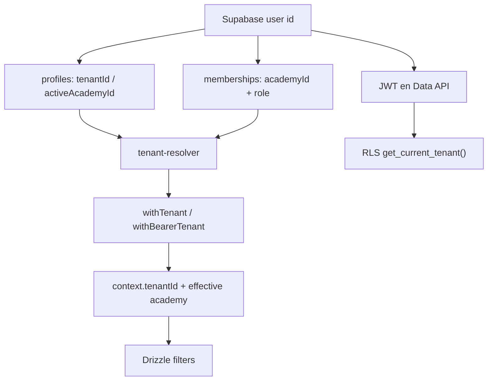

# Auditoría multitenant

## Procedencia y propagación

`academyId` puede venir de path/body/query, pero debe verificarse contra el tenant resuelto. `tenantId` no debe aceptarse del cliente. Ownership se prueba con `academies.ownerId` o membership owner; membership coach/viewer habilita contexto de academia. Los recursos familiares requieren una condición adicional de vínculo.

## Cobertura observada

- 204 APIs clasificadas como tenant y 39 bearer; ninguna marcada `risky` por el auditor estricto.
- 69 tablas tenant-scoped tienen RLS declarado.
- Queries modernas suelen incluir `tenantId` y `academyId`; `verifyAcademyAccess` solo acredita pertenencia de academia, no capacidad del usuario.
- Muchos componentes cliente usan Supabase directamente, por lo que RLS semántica es tan importante como los filtros Drizzle.

## Hallazgos

| ID | Archivo/símbolo | Problema y evidencia | Severidad | Riesgo de producción | Recomendación concreta | Responsable |
|---|---|---|---|---|---|---|
| MT-001 | `src/lib/authz.ts:275-293`; `permissions-service.ts` | Membership resuelve tenant, pero el permiso requerido no se deniega si no existe custom `roleId`. | Crítica | BOLA funcional dentro del tenant para viewer/coach. | Separar pertenencia de autorización; deny-by-default con matriz baseline. | Sol |
| MT-002 | `supabase/rls-consolidated.sql` | `tenant_id = get_current_tenant()` aísla tenants, no sujetos dentro del tenant. | Crítica | Parent/athlete podría leer filas de otros menores de su academia. | Policies por `guardian_athletes`, `athletes.user_id`, asignación coach y rol owner. | Sol |
| MT-003 | `src/components/**`, hooks con `@/lib/supabase/client` | Acceso directo del cliente amplía la superficie de RLS y grants. | Alta | Bypass de APIs más estrictas mediante REST/Realtime directo. | Inventariar cada tabla browser; revocar las no necesarias o ofrecer vistas/RPC mínimas. | Sol |
| MT-004 | `src/app/api/athletes/route.ts:73-85` y análogas | `verifyAcademyAccess` comprueba academia↔tenant, no usuario↔capacidad/recurso. | Alta | Operación administrativa por miembro limitado. | Requerir capability y, para lectura limitada, resource scope; test academia A/B. | Sol |
| MT-005 | `profiles.tenantId` + memberships múltiples | Un tenant activo en perfil y memberships por academia crean estados divergentes; existe auto-actualización del perfil. | Media | Contexto inesperado al cambiar academia o revocar membership. | Invariantes transaccionales, selección explícita y tests de revocación/cambio concurrente. | Terra |
| MT-006 | validador RLS | 100% cobertura declarada puede interpretarse como aislamiento completo. | Alta | Go-live con policies demasiado amplias. | Renombrar métrica a “RLS enabled/declarado” y añadir matriz semántica con JWT reales. | Sol |

## Estado Día 2

- MT-002: **parcial, migración aplicada**. Core de menores/clases/billing ya separa manager, coach asignado, guardian y self; otros dominios siguen tenant-wide y requieren fixture PostgREST/Realtime.
- MT-003: **abierto acotado**. Se inventariaron Data API y 15 tablas/canales Realtime; no se retiraron canales sin evidencia de uso.
- MT-006: **cerrado en tooling/docs**. `validate:rls:semantics` se etiqueta como estático y `test:rls:local` aporta ejecución PostgreSQL real.
- El fixture demuestra academia A/B, sujetos cruzados y recursos asignados. La migración está aplicada en remoto; la paridad PostgREST/Realtime real queda pendiente por ausencia de un stack aislado equivalente.

## Pruebas mínimas de cierre

Por cada dominio sensible: owner permitido; coach permitido solo con capability/asignación; parent solo sus hijos; athlete solo propio; viewer denegado; super_admin según contrato; acceso a academia B siempre 403/0 filas. Ejecutar tanto API Drizzle como Data API Supabase con JWT.

## Avance Día 3

- MT-001 permanece cerrado; owner/admin global ya no eleva los helpers de recurso y owner A/B tiene negativa ejecutable.
- MT-004 cerrado: el registro cubre los dominios sensibles, `/api/athletes` ignora overrides de tenant, los recursos dinámicos se autorizan contra su academia real y las negativas BOLA prueban academia A/B, tenant, clase y atleta. El inventario marca cero revisiones manuales.
