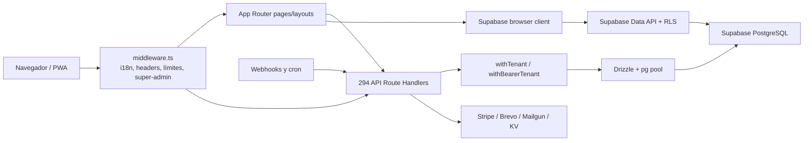

# Mapa técnico de Zaltyko

## Snapshot auditado

| Campo | Valor |
|---|---|
| Fecha | 2026-07-16 (Europe/Madrid) |
| Rama / `HEAD` | `main` / `1e3cb8ff8ae1274e72ef47d81be3096c3b18d1a3` |
| Alcance | Árbol de trabajo completo, incluidos 48 archivos modificados y 6 no rastreados preexistentes |
| Runtime local | Node `v22.22.3`, pnpm `9.15.3` |
| Tamaño | 1.932 archivos rastreados; 1.443 TS/TSX; 167 páginas; 294 Route Handlers |

Este snapshot no equivale a `HEAD`: los cambios preexistentes se preservaron y no se atribuyen a la auditoría. La auditoría solo añade `docs/audit/**` y tres notas de vault.

## Stack observado

- Next.js 15.5.19, React 19 y App Router; Tailwind CSS y shadcn/ui.
- Supabase Auth/SSR y PostgreSQL; Drizzle ORM sobre `pg` para servidor. `next-auth` fue retirado al no existir uso en `src/`; quedan referencias históricas fuera del contrato operativo.
- Stripe Billing/Connect, Brevo, Mailgun inbound legado, Sentry, PostHog, Vercel KV y Vercel.
- Vitest para unidad/integración y Playwright para E2E/a11y. En esta auditoría no se ejecutó Playwright CLI por falta de autorización específica.

## Arquitectura real

## Módulos y límites

| Área | Ubicación principal | Responsabilidad |
|---|---|---|
| Sitio público | `src/app/(site)`, `src/app/page.tsx` | Landing, pricing, clusters SEO, marketplace, eventos, empleo |
| Auth/onboarding | `src/app/auth`, `src/app/onboarding`, `src/app/invite` | Login, registro, callback, recuperación e invitaciones |
| Academia moderna | `src/app/app/[academyId]` | 62 páginas de operación de academia |
| Legacy | `src/app/dashboard` | 30 páginas compatibles/redirecciones en ventana de retirada |
| Super-admin | `src/app/(super-admin)`, `src/app/super-admin` | 13 páginas globales |
| API | `src/app/api` | 294 handlers: 204 tenant, 39 bearer, 12 super-admin, 16 públicos, 7 cron, 4 webhooks, 10 deprecados, 2 dev |
| Datos | `src/db/schema`, `drizzle`, `supabase/migrations` | 88 módulos de schema, 82 con tablas y 34 declaraciones de enum |
| Autorización | `src/lib/authz.ts`, `src/lib/authz/**` | Sesión, perfil, tenant, permisos y rate limit verificado |
| UI | `src/components`, `src/app/**` | Navegación, módulos y primitivas compartidas |

## Contexto servidor/cliente

- Los handlers y Server Components acceden con Drizzle usando una conexión privilegiada que no hereda la identidad JWT del usuario; el aislamiento depende de filtros explícitos y wrappers.
- Componentes cliente importan `@/lib/supabase/client` y alcanzan la Data API; ahí RLS es la frontera efectiva.
- Variables `NEXT_PUBLIC_*` se incorporan al bundle. Claves de servicio, DB, Stripe y proveedores de email deben permanecer solo en servidor.
- `middleware.ts` se reexporta desde el archivo no rastreado `src/middleware.ts`; ambos forman el punto de entrada actual.

## Hallazgos de arquitectura

| ID | Archivo/símbolo | Problema y evidencia | Severidad | Riesgo de producción | Recomendación concreta | Responsable |
|---|---|---|---|---|---|---|
| ARCH-001 | `package.json`; `src/lib/supabase/**` | El runtime usa Supabase Auth SSR y no tiene imports `next-auth`; la dependencia histórica fue retirada y `AGENTS.md`/`.env.example` ya describen Supabase como fuente canónica. | Baja | Documentación histórica externa al contrato operativo aún puede confundir. | Mantener una única guía Supabase y marcar documentos legacy como superseded antes de archivarlos. | Terra |
| ARCH-002 | `middleware.ts:26,256-284`; `src/middleware.ts` | Dos entradas de middleware y una redirección de `/` a un cluster compiten con `src/app/page.tsx`. | Alta | La landing principal queda inaccesible en el árbol local y un cambio sin commit podría alterar adquisición al desplegarse. | Elegir contrato canónico de `/`, cubrirlo con test de redirect/render y consolidar el entrypoint en un cambio posterior revisado. | Terra |
| ARCH-003 | `src/db/index.ts:28-45` | Pool de hasta 50 conexiones por instancia serverless. | Media | Agotamiento de conexiones y latencia/errores bajo escalado horizontal. | Validar modo del pooler Supabase y fijar presupuesto por instancia con métricas y prueba de carga. | Sol |
| ARCH-004 | Build y módulos con acceso a `db` | El build abrió conexión DB durante page collection. | Media | Builds no reproducibles, acceso accidental a producción y fallos CI por dependencia externa. | Eliminar lecturas DB en build o usar snapshot/fallback explícito; CI debe construir sin credenciales productivas. | Sol |

## Baseline de verificación

`pnpm lint`, `pnpm typecheck`, `pnpm build` (219 páginas), auditor API estricto, RLS (69 tablas, 100% cobertura declarada), migraciones (6 Drizzle + 40 Supabase) y `verify:production` pasan. Vitest: 91 archivos/643 tests. El audit high/critical de dependencias pasa; quedan una vulnerabilidad baja y una moderada transitivas.
